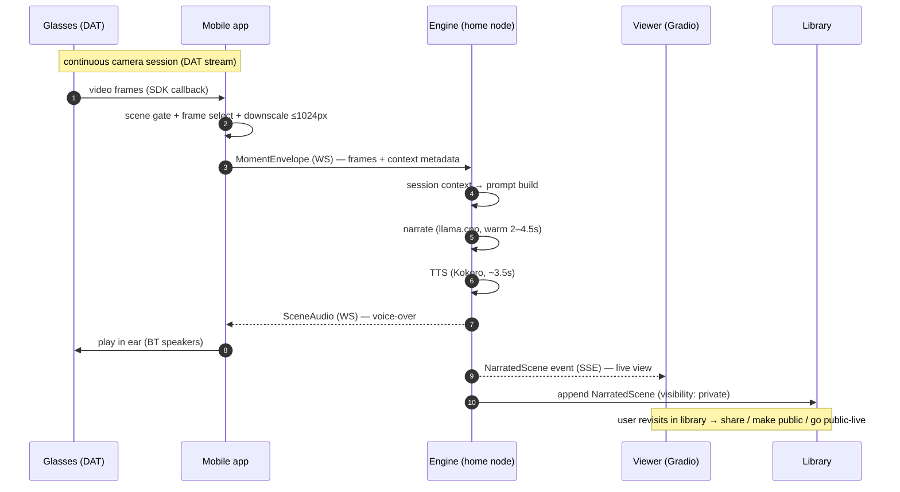

# Small Cuts — Product Architecture (the real-time loop)

> Scope: the **product** (post-hackathon #29). The hackathon Space remains
> described by [docs/architecture.md](../architecture.md) — it is the public
> demo shell of this architecture, with uploads standing in for the live
> glasses stream.

## Current state (2026-06-12)

Batch pipeline, fully working: photo/clip upload → frame pick → Qwen3-VL-8B
narration (ZeroGPU or llama.cpp) → title card + on-demand Kokoro TTS. Live on
the hackathon Space. **No streaming, no session memory, no library, no mobile
app yet** — those are exactly what the three teams build.

## Components & teams

| Component | Owner | Optimization goal |
|---|---|---|
| **Capture apps** (iOS/Android + Meta Wearables DAT) | Team Mobile | minimize signal sent, maximize moment quality, real-time delivery |
| **Narration engine** (home node: llama.cpp + Kokoro + session context) | Team Inference | prompt + session context + frames → Wes-Anderson-grade voice-over; max quality, min latency |
| **Viewer platform** (Gradio app: live view + library) + hackathon Space | Team Space | feel like a reference live-streaming platform (#28) |

Coordination: contracts below are the only coupling. Each team optimizes
freely inside its boundary; **contract changes are PRs labeled
`contract-change` and require orchestrator review**.

## The temporal diagram

One narrated moment, end to end ("scene-gated discrete pipeline", see D1):

**Latency budget v1** (gate fires → voice in ear), measured numbers in
parentheses:

| Stage | Budget |
|---|---|
| Phone: gate + select + encode + send | ≤ 1.0 s |
| Engine: narration, warm llama.cpp on Metal | ≤ 4.5 s (measured 2.0–4.2 s) |
| Engine: TTS, warm Kokoro CPU | ≤ 4.0 s (measured 3.6 s) |
| Return + playback start | ≤ 0.5 s |
| **End-to-end v1, warm p50 target** | **≤ 10 s** |
| End-to-end p90 (queueing, cold worker, retries) | ≤ 15 s |
| Stretch (sentence-pipelined narration→TTS, streamed audio) | ≤ 6 s |

Honesty notes (from adversarial review): the phone-side stage and queueing
are UNMEASURED — Team Mobile's first deliverable includes real upload
numbers, and `sent_at`/`latency_ms` exist in the contracts precisely to
attribute every millisecond. **A ~10 s voice is retrospective by nature**:
the narrator comments on the moment just past — the deadpan-omniscient
voice is written for exactly that register, the gate keeps moments sparse,
and the ≤ 6 s stretch (a future MAJOR contract version with real chunk
semantics — not a v1 toggle) closes the rest. Streamed audio is a
cross-team feature: Mobile must build buffered playback for it; it goes
through contract-change review, not a silent engine-side switch.

## Decisions (status: adopted unless challenged via PR)

- **D1 — Unit of work is a gated Moment, not continuous video.** The phone
  runs the cheap signal processing (scene-change gate — #15's M3.5 work
  becomes mobile-side; frame selection; downscale to ≤1024px longest side,
  matching the verified Qwen-VL vision-token constraint) and emits discrete
  `MomentEnvelope`s. Rationale: bandwidth (the "optimize signal sent" goal),
  battery, and the validated single-frame narration strategy. Continuous
  streaming later = same contract at higher envelope frequency.
- **D2 — Transport is one bidirectional WebSocket per session** (phone ↔
  engine, over the tailnet): envelopes up, audio + acks down. WebRTC only
  becomes interesting if D1 flips to raw media. Team Mobile may challenge
  with measurements.
- **D3 — The engine lives on the home node (Mac Studio), llama.cpp-first.**
  Measured: warm narration 2.0–4.2 s on Metal — faster than ZeroGPU warm.
  The HF Space is the public demo shell, not the product engine.
- **D4 — Audio returns as one complete clip per scene (v1).** Kokoro clips
  are 5–15 s; streaming TTS buys ~2 s at real complexity cost AND requires
  mobile-side buffered playback — so it is a future MAJOR contract version
  decided cross-team, not an engine-side toggle.
- **D5 — Session context lives engine-side.** The phone sends only moment
  metadata (time, optional location label, optional user hint); the engine
  owns session memory (recent narrations, day timeline → #20) and prompt
  construction. Mobile never sees prompts; Inference never sees raw streams.
- **D6 — Library is engine-side storage** (filesystem media + sqlite index),
  entries are `NarratedScene`s with visibility `private | shared | public`
  (default private). The viewer reads; it never writes media.
- **D7 — Viewer subscribes over SSE** to the engine's scene stream; library
  entries and live events share the same `NarratedScene` schema (`seq` +
  `Last-Event-ID` for resume). The viewer's only write is visibility
  metadata via `PATCH /v1/scenes/{id}` — never media. "Public live" later =
  the same stream behind an auth/visibility check; `owner`/`share_token`
  are reserved in the schema now (v1 engines are single-user on the
  tailnet).
- **D8 — Backpressure: queue depth ≤ 1, coalesce-to-newest.** The engine
  acks every envelope at admission (`accepted | duplicate | rejected |
  dropped_coalesced`), emits busy/ready status frames, and replaces a
  queued un-started moment with a newer arrival. The phone suppresses its
  gate while the engine is busy. Narrating stale moments is worse than
  skipping them.
- **D9 — Playback freshness.** `SceneAudio` carries `play_by`
  (default created + 60 s); the app never overlaps clips and drops any
  clip whose deadline passed before playback started. Failures arrive as
  first-class error frames (stage, code, retryable) on both the session
  socket and the viewer stream — consumers render an honest timeline, not
  just the success path.

## Contracts

Defined and enforced in [docs/contracts/](../contracts/README.md):

1. **MomentEnvelope** (Mobile → Engine) — `moment.schema.json`
2. **ControlFrame** ack/error/status (Engine → Mobile) — `control.schema.json`
3. **NarratedScene** (Engine → Viewer & Library) — `narrated-scene.schema.json`
4. **SceneAudio** (Engine → Mobile) — `scene-audio.schema.json`
5. **Session context spec** (engine-internal, but the metadata mobile must
   supply is part of MomentEnvelope) — in the contracts README

Contract set 1.1.0 incorporates the adversarial review (Codex GPT-5 +
Gemini 3.1 Pro, both "needs_changes" → all blockers resolved): admission
acks, error frames, backpressure, freshness deadlines, SSE resume,
visibility-mutation endpoint, lockstep versioning policy.

Enforcement: JSON Schemas are the source of truth; every team's CI validates
its golden samples against them (`tests/test_contracts.py` pattern); schemas
are semver'd in their `$id`; breaking changes bump major and require a
migration note in the PR.
