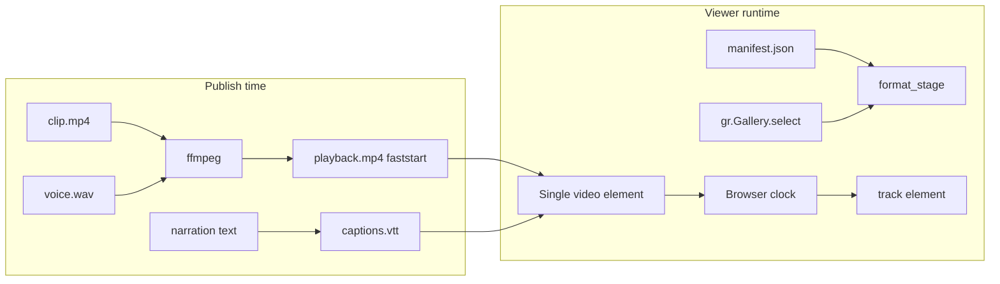

# Small Cuts Player Redesign — Composer Proposal (2026-06-17)

## 1. Position

**Hybrid B′ (native single-element clock + publish-time mux)** — Retire the dual-element master-slave architecture (`#sc-voice` + muted `<video>` + 120 ms poll), but do **not** blindly swap in `gr.Video(value=remote_url)` on relay Spaces; instead mux narration into one faststart MP4 at publish time and drive **one** native media element (either `gr.Video` for local `/gradio_api/file=` paths or a slim single-`<video>`+`<track>` `gr.HTML` shell for direct HF bucket URLs).

The research brief’s pure-(B) recommendation understates a Gradio constraint we already hit in production: remote URLs as component **values** trigger server-side download/transcode (Gradio #3940/#10726), while our relay path deliberately serves `https://huggingface.co/buckets/.../resolve/...` URLs (`hf_relay.py:221–246`). Pure native components work for seed/upload/engine; relay needs a transport shim, not a sync engine.

## 2. Target architecture

### Open Q1 — Muxed, not decoupled (decide first)

**Mux at publish.** The product’s cinematic loop (short b-roll under longer Kokoro narration) is real — see `render_stage_html` at `viewer.py:834–841` (`loop` on a clip shorter than `duration`). That semantics belongs in the **asset**, not in JS modulo arithmetic (`scVideoTargetTime`, `viewer.py:1739–1742`). At publish (Modal `small_cuts_postcut.py`, engine library, glasses relay writer):

```bash
ffmpeg -stream_loop -1 -i clip.mp4 -i voice.wav \
  -map 0:v -map 1:a -c:v copy -c:a aac -shortest -movflags +faststart playback.mp4
```

Add `media.playback_url` (contract minor bump) **or** treat muxed file as the viewer-facing `clip_url` while retaining separate `audio_url` for iOS `SceneAudio`. Generate `captions.vtt` server-side from `_subtitle_chunks()` logic (`viewer.py:802–818`) — timed by equal splits over `duration`, good enough for v1; refine later.

**Clock:** one `<video>` element. No hidden `#sc-voice`. Progress = native `timeupdate`; captions = native `<track>` via `gr.Video(subtitles=...)` or inline `<track kind="captions" src="...">`.

### Components & data flow

| Surface | Mechanism | Gradio APIs |
|--------|-----------|-------------|
| Stage (local/seed/upload/engine) | `gr.Video(value=path, autoplay=False, loop=False, subtitles=vtt_path, show_download_button=False, elem_id="sc-stage")` | `gr.set_static_paths` (`viewer.py:1469, 2035`), `/gradio_api/file=` range 206 |
| Stage (relay, direct HF URLs) | Minimal `gr.HTML`: single `<video src="{playback_url}"><track ...>` — **no second audio element** | Same as today’s URL delivery, minus sync JS |
| Controls | `gr.Button(icon=...)` play/pause, rewind/forward (clip-to-clip) | `.click(fn, inputs=[scenes_state, index_state], outputs=[stage_video, play_btn, header, ...])` + `gr.update(icon="pause"|"play")` |
| Progress | Native video scrubber **or** read `playback_position` on `.pause`/`.end` | `gr.Video(playback_position=...)` if pin supports it |
| Library | unchanged | `gr.Gallery(..., allow_preview=False).select(fn, SelectData)` → update `pinned_state` → reload scene |
| State | unchanged | `gr.State` scenes/pinned/liked (`viewer.py:2068–2076`) |
| Relay refresh | unchanged | `gr.HTML(js_on_load=RELAY_EVENT_BRIDGE_JS)` + `trigger('relay_scene')` (`viewer.py:1993–2006, 2222–2230`) |
| Upload gen overlay | keep clapperboard | `__scStartGeneration` / `__scFinishGeneration` (~50 lines), not the sync loop |

**Scene load path:** `format_stage()` (`viewer.py:752–796`) gains `playback_src` (mux URL) and `subtitle_src` (VTT URL). Shelf select / relay refresh / engine poll all call one `load_scene(index)` returning `gr.update` on `stage_video`, header, gallery `selected_index`, play button icon.

**Still-image scenes (no clip):** `gr.Image` poster + `gr.Audio` for voice-only; advance on `gr.Audio.end()`. Rare in hero seed but handled.

**Live channel (future):** plain `gr.Video(value=url)` for rail replay; `gr.Video(streaming=True, autoplay=True)` + `demo.queue()` only for forward-only “happening now” — not mixed into this PR.

### Open Q2–10 (embedded)

- **Q2 Autoplay:** Boot paused (current invariant). First play = user gesture on `gr.Button`; call `video.play()` in a thin `js=` on that button only (preserves activation without delegating entire pill to DOM).
- **Q3 Rail vs live:** Gallery = finished cuts, arbitrary seek via native scrubber; no `streaming=True` on rail.
- **Q4 Captions:** Python `narration_to_vtt()` → `.vtt` beside scene in bucket/cache; pass to `gr.Video(subtitles=...)`.
- **Q5 Public URLs:** Validate `macayaven/*` bucket objects are anonymously GET-able; fallback lazy-cache to `cache_dir` + `gradio_file_url()` (`hf_relay.py:226–237`).
- **Q6 Encoding:** Audit existing clips; re-encode non-faststart seed assets; enforce in `_write_clip_mp4` / ffmpeg step.
- **Q7 Concurrency:** `demo.queue(default_concurrency_limit=4, max_size=32)` — UI handlers cheap on CPU-basic; no infinite generators in this PR.
- **Q8 Gradio 6 pin:** Verify `playback_position`, `gr.Video.buttons`, interactive `gr.HTML(js_on_load=)` on Space pin before merge.
- **Q9 State:** No PyAV in `gr.State`; keep module-level session dict if needed.
- **Q10 Theme:** Map progress to `theme.set(slider_color=...)` in `theme.py`; retain `VIEWER_CSS` only for 9:16 geometry + theater layout.



## 3. Symptom map (1:1)

| # | Symptom | Fix |
|---|---------|-----|
| 1 | Video startup latency | One element, one range-request stream; `preload="metadata"` + poster from `frame_url`; `fetchpriority="high"` on stage only; no second audio fetch. Direct HF URLs already bypass server hydration (`hf_relay.py:268–269`). |
| 2 | Desync on stall | Browser stalls the **only** clock; audio and video cannot diverge. Delete `scPauseVoiceForVideoBuffer` / `waiting` slave logic (`viewer.py:1750–1777`). |
| 3 | Frame jump on pause/resume | No modulo resync (`scSyncVideoToAudio`); pause freezes one timeline. |
| 4 | Wrong play icon (video-only) | Python owns icon via `gr.update(icon=...)` from scene metadata (`has_audio` flag), not poll (`viewer.py:1847–1854`). |
| 5 | Jank + maintenance | Delete ~200 lines of sync loop (`viewer.py:1824–1867`), `#sc-voice`, `_audio_html` (`viewer.py:1519–1529`), caption/progress DOM drivers. Keep ~150 lines: favicon, HF header, upload form, clapperboard, relay bridge. |

## 4. Migration plan

**Phase 0 — Data (prerequisite, matches brief’s A-layer):** Confirm `direct_media_urls=True` on Space; extend `_list_media_keys()` if playback VTT needs hydration in non-direct mode.

**Phase 1 — Publish pipeline:**
- `modal_app/small_cuts_postcut.py`: after TTS, ffmpeg mux → upload `playback.mp4` + `captions.vtt`.
- `src/small_cuts/engine/library.py`: same helper (shared `media/mux.py`).
- Contract minor: optional `media.playback_url`, `media.subtitles_url` in `narrated-scene.schema.json` + golden samples.

**Phase 2 — Viewer (`viewer.py`):**
- Add `render_stage_video_html(playback_url, poster, vtt_url, badge)` — **single** `<video>`, no `#sc-voice`.
- Replace `stage` + `audio` gr.HTML pair with `gr.Video` (local modes) or new single-element HTML (relay).
- Rewire shelf/live/relay handlers to output scene components via one `load_scene()`.
- Replace DOM-delegated play pill with `play_btn.click(toggle_play, js=PLAY_GESTURE_JS)` + Python icon state.
- **DELETE:** `_audio_html`, `_subtitle_chunks` from HTML path (move to Python VTT), `render_stage_html` video branch (or reduce to poster-only fallback), `PLAYBACK_SYNC_JS` lines 1739–1867 (sync/interval/caption/progress), hidden `audio` gr.HTML host (`viewer.py:2133–2134`).
- **KEEP:** `PLAYBACK_SYNC_JS` favicon (1577–1600), HF header observer (1602–1612), header→live (1614–1621), volume→video.volume (1623–1629), upload form fixes (1631–1732), clapperboard (1869–1964). Split into `VIEWER_CHROME_JS` + `UPLOAD_OVERLAY_JS` + `RELAY_EVENT_BRIDGE_JS`.

**Phase 3 — Tests:** Update `tests/test_viewer.py` (assertions on `PLAYBACK_SYNC_JS` sync behavior become VTT/mux tests); add `tests/test_media_mux.py`.

**Phase 4 — Backfill:** Re-mux hero seed in `demo_seed.py` / `seed_media/`.

## 5. Resource efficiency

- **Bytes:** One media stream vs clip+audio; VTT is ~1 KB. Mux adds no net CDN cost (same bits, one request).
- **Requests:** Stage LCP = 1 video (+ optional VTT); shelf thumbs unchanged (direct URLs, `hf_relay.py:268`).
- **Main thread:** Zero 120 ms timer; native `timeupdate` only. Chrome JS drops ~8 calls/sec × N viewers.
- **CPU-basic:** Space does no ffmpeg, no `fs.cat` on stage media in relay mode; mux runs on Modal/engine at publish.
- **Many viewers:** Stateless scene dict + direct bucket URLs; no per-viewer sync state.

## 6. Risk + unknowns

| Risk | Mitigation |
|------|------------|
| `gr.Video(value=remote_url)` downloads on server | Relay uses HTML transport with direct URL; local modes use file paths only |
| Mux latency at publish | Async; viewer shows clapperboard until `playback.mp4` lands (existing pattern) |
| Autoplay blocked | Unchanged: boot paused, gesture on play button |
| Non-faststart legacy clips | ffmpeg `-movflags +faststart` on backfill |
| Private bucket 401 | Smoke on `macayaven/*`; cache fallback |
| Contract churn | Additive minor only; old scenes fall back to on-the-fly mux in Modal retry job |

**Cheapest de-risk experiment (30 min, local):** ffmpeg mux one seed clip + mp3 → open in bare `gr.Video(subtitles=vtt)` demo with `uv run --no-sync python app.py` upload mode; confirm (a) single scrubber stays synced through artificial Network throttling, (b) pause/resume frame-stable, (c) relay URL in **HTML** `<video src>` loads without Gradio server download (watch Space process RSS / logs).

## 7. Test / verification plan

- **Local gate:** `uv run ruff check . && uv run ruff format --check . && uv run pytest` (must pass `tests/test_viewer.py`, `tests/test_contracts.py`, new mux tests).
- **Manual local:** seed mode — play/pause ×10, shelf switch, rewind/forward clip-to-clip, video-only seed if present, upload clapperboard path.
- **Live Space smoke** (only with Carlos approval per CLAUDE.md): load staging Space, first-frame LCP <3 s on throttled 4G, stall recovery, relay SSE push refreshes scene without timer poll.

## 8. Confidence + strongest dissent

**Confidence: 0.72**

**Strongest dissent against my own position:** Publish-time mux is a **pipeline commitment**, not a viewer tweak. If the owner wants **live TTS re-voice without re-encoding**, or true decoupled b-roll under narration with **runtime-adjustable** loop points, mux bakes decisions into the asset and **Route C** (Svelte `VideoScene` with `FileData` URLs and event-driven 0.2 s drift correction — the one good idea from `gradio_video_slider`) becomes the honest architecture. Mux also requires a contract touch and backfill of five hero cuts before the portfolio demo looks coherent. If mux validation fails on ZeroGPU/Modal timing budgets, we would fall back to **improved A** (event-driven dual-element, delete `setInterval` only) — better than today, but still “pretending to build our own player.”

---

*Author: Composer (independent panel member). Branch of record: `codex/video-lcp-streaming`. No files modified.*
